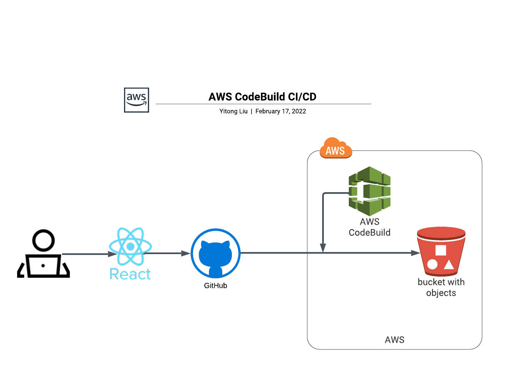

# Modern Blog

## An Blog demo application

## Technologies Used
 * NextJS
 * React
 * GraphQL
 * TailwindCSS

## Description

This was my personal project. The basic idea is to build a modern blog for introducing cutting-edge technology tops.

The website mainly includes 4 parts:
 1. Header
 2. PostCard
 3. PostDetails
 4. RelatedPost and side-Category

## Setup/Installation

- Clone this repo to your desktop
- Use command `npm install` to install all necessary packages
- Use command `npm run dev` to start the server and open localhost url in your browser

## Usage

[localhost:1234](localhost:1234)

## Deployment
- The deployment of static website was automatical utilizing AWS codeBuild and S3 when there is on main branch

- See Vercel Demo [here](https://modern-blog-xi.vercel.app/)
- See AWS Static Demo [here](http://blog-app-2021.s3-website.us-east-2.amazonaws.com/) to see the Demo

## License

